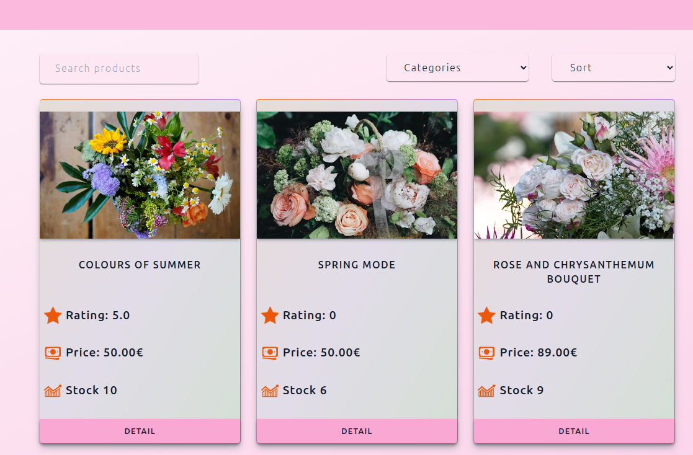

# Blossom Avenue

## Overview

This project is the backend service for Blossom Avenue which is a flower shop application, developed using C# and the .NET Core framework. The backend manages various functionalities including user management, product management, and order processing. The system supports two types of users: **Admin**, **Employee** and **Customer**.

### Key Features

- **User Management**:

  - User can create and update their profile.
  - Admin user can update update other users
    - Change user role and active status.
    - Delete user.

- **Authentication Management**

  - Users can authenticate with their credentials
  - When users logged in, a jwt access token is send as response and a HttpOnly refresh token is set to user's browser.
  - Users can access resources from Authorized routes with valid access token
  - When access token is expired, they can make a request to /refreshToken endpoint with expired access token and refresh token from cookie
    - expired access token is required to generate new access token and refresh token.
  - Users can logged from all the session by making a request to /logout route with access and refresh token.

- **Product & Category Management**:

  - Customers can browse sort, filter products.
  - And can also view product detail
  - Admins and Employees can create, view, update, delete
    - Product Categories
    - Products
    - Images
    - Variations
      - Each product can have multiple variation and images.

- **Cart Management**
  - Customers can add and remove product to their car as well as can increase and decrease the amount by one at a time.
  - Customers can clear their cart altogether.
  - Cart info is stored in database, so customer can still view their cart from another session.
- **Order Management**

  - Customer can place order, view all of their orders and order by id.
  - Admin or Employee can update or delete order
    - Such as change status, shipping address.

- **Product Reviews**:
  - Customers can create, update, delete, and view reviews for products.

### Technologies Used

- **.NET Core**: A cross-platform framework for building the backend API.
- **Entity Framework Core**: ORM for database interactions.
- **XUnit**: Unit testing framework for ensuring the reliability of the application.

## Project Structure

The project follows a clean architecture pattern, making it easy to maintain and scale.

- **Presentation**: Handle incoming HTTP requests and route them to the appropriate service.
- **Services**: Contain business logic for managing users, products, and orders.
- **Infrastructure**: Interact with the database using Entity Framework Core.
- **Core**: Define the data structure for users, products, orders, and reviews.
- **Tests**: Unit tests written using XUnit to ensure code quality and functionality.

## API Documentation

The project is deployed.

[The Swagger documentation](https://blossomavenue-f2grfmdmepbcb4es.northeurope-01.azurewebsites.net/index.html)

The front end is deployed as well, you can visit in the following link.

[Blossom Avenue](https://blossomavenue.vercel.app/)



## Setup and Installation

The deployed project has some dummy users, product, categories, variations review etc.
You can use the following credential to test the endpoints.

- Admin user

  - User Name: admin1@test.com
  - Password: Abcd1234!

- Employee user

  - User Name: emp1@test.com
  - Password: Abcd1234!

- Customer user
  - User Name: cus1@test.com
  - Password: Abcd1234!

### Testing the project locally

- [.NET Core SDK](https://dotnet.microsoft.com/download/dotnet-core)
- [SQL Server](https://www.microsoft.com/en-us/sql-server/sql-server-downloads) (or any compatible database)
- [Entity Framework Core Tools](https://docs.microsoft.com/en-us/ef/core/cli/dotnet)

### Steps to Run the Project

1. **Install Dependencies**:

   ```bash
   dotnet restore

   ```

2. **Set up database**:
   Update the connection string in appsettings.Development.json to match your database configuration.
   Run the following command to apply migrations

   ```json
   {
     "Logging": {
       "LogLevel": {
         "Default": "Information",
         "Microsoft.AspNetCore": "Warning"
       }
     },
     "AllowedHosts": "*",
     "ConnectionStrings": {
       "DefaultConnection": "Host=you_host; Port=your_port;Database=db_name;Username=user_name;Password=db_pass"
     },
     "JwtConfiguration": {
       "Secret": "mySecreteKey",
       "Issuer": "http://localhost:5000",
       "Audience": "http://localhost:5000",
       "ExpiryMinutes": 15
     }
   }
   ```

3. **Run application**:

   ```bash
   cd source/BlossomAvenue.Ingrastructure
   dotnet run

   ```

4. **Migration and seed data**

- The project already contains some seed data
- Above mentioned user credentials can be used for authentication.

```bash
dotnet ef migrations add initial_migration
dotnet ef database update
```
